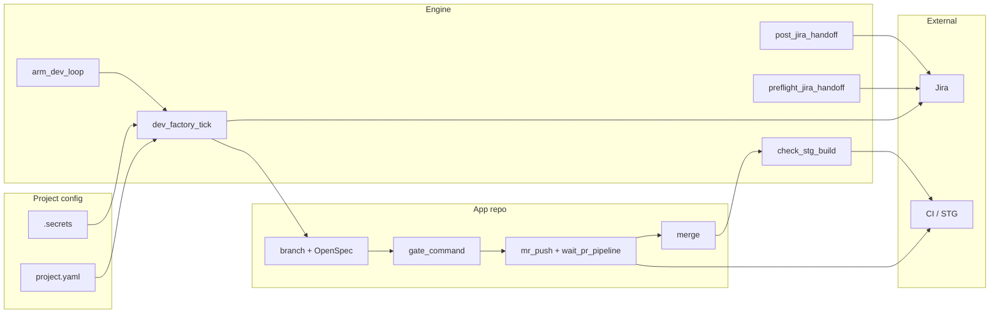

# Dev Agent — architecture

Decision record: how the dev factory is layered, what each repo owns, and how agents integrate
with an application **without** embedding orchestration inside the app.

---

## Decision

**dev-agent is a process runner + skills/rules + integration layer on top of an app repo** —
not a second application, and not a duplicate of the app’s build stack.

| Layer | Role | Git home |
|-------|------|----------|
| **Engine** | Loop scheduler, Jira/STG scripts, portable `lib/`, generic skills/rules | `dev-agent` (public/generic) |
| **Project** | Epic, STG, git host, secrets, DoD, human exceptions, optional MR overrides | `dev-agent-project-<slug>` or local `projects/<slug>/` |
| **App** | Product code, OpenSpec, CI gate, MR/deploy scripts, e2e | Application repo (separate root) |

Integration is **by reference** (`project.yaml` → `app.repo_path`), not by merging engine code into the app.

Paired with **qa-agent** for Validate/Testing → Done. Dev stops at Validate/Testing; coordination is Jira-only (labels, comments, QA RETURN).

---

## What each layer owns

### Engine (`dev-agent/`)

**Agent brain + deterministic runner**

| Owns | Does not own |
|------|----------------|
| `.cursor/skills/` — loop, MR pipeline, Jira handoff, phases, **engine CR** | Product routes, UI, domain logic |
| `.cursor/rules/` — engine constraints, active factory, **code-review** (engine PRs) | App-specific OpenSpec content |
| `lib/` — JQL builder, handoff templates, QA RETURN gates, loop wiring, review gate parser | Hardcoded epic keys or hosts |
| `scripts/` — tick, arm loop, handoff, STG verify, app delegation, **pre_merge_check** | App CI gate implementation |
| `projects/_template/` | Live `projects/<slug>/` (except template) |
| `SETUP.md`, portability checks, unit tests | Secrets |

### Project (`projects/<slug>/`)

**Per-app factory configuration**

| Owns | Does not own |
|------|----------------|
| `project.yaml` — epic, JQL filters, git, STG, app pointer | Engine scripts (consume, don’t fork) |
| `.secrets/` — Jira, Bitbucket/GitHub tokens | Committed credentials |
| `docs/DEFINITION-OF-DONE.md`, `HUMAN-EXCEPTIONS.md` | Product source |
| `project-memory.md` — loop cadence, run history | |
| Optional `.cursor/rules/` — MR/OpenSpec overrides | |

Tracked in a **separate project repo** or local gitignored clone — not shipped inside the engine GitHub repo.

### App (application repo)

**What gets built and shipped**

| Owns | Does not own |
|------|----------------|
| Product code, tests, e2e | Dev factory loop logic |
| OpenSpec specs/changes + app OpenSpec skills | Generic Jira handoff templates |
| `gate_command`, `mr_push_command`, CI scripts, **app PR code review** | Engine `lib/devFactory*.ts` |
| `wait_pr_pipeline.sh`, `wait_main_deploy.sh` (typical) | Backlog tick / QA RETURN gates |

Engine **delegates** to app scripts via `run_app_script.sh` and paths in `project.yaml`.

---

## Runtime model

Two runtimes, two jobs — intentionally separate.

```text
┌─────────────────────────────────────────────────────────┐
│  Engine runtime (dev-agent/)                            │
│  Node + tsx + yaml + vitest — small, engine-only deps   │
│  Runs: tick, handoff, STG check, config load            │
└──────────────────────────┬──────────────────────────────┘
                           │ project.yaml → app.repo_path
                           ▼
┌─────────────────────────────────────────────────────────┐
│  App runtime (application repo)                         │
│  App’s own Node/npm (or other stack)                    │
│  Runs: gate, build, test, MR push, app CI scripts       │
└─────────────────────────────────────────────────────────┘
```

- Engine Node is **not** the app’s `node_modules`. Do not import app code from engine `lib/`.
- **Code review split:** engine PRs → `dev-code-review` + `.github/workflows/code-review.yml`; app MRs → app repo CR pipeline (dev-agent waits for “review clear” only).

---

## Agent workspace layouts

| Layout | Workspace root | When |
|--------|----------------|------|
| **Recommended** | `dev-agent/` | Factory-first; agent reads `projects/<slug>/`, runs scripts from engine root |
| **Sibling** | Parent folder containing `dev-agent/` and app checkout | Meta-workspace; set `app.repo_path` relative to engine |
| **App-primary** | Application repo | Possible, but agent must use absolute paths to engine scripts |

Rules/skills apply when paths match `.cursor/rules/dev-engine.mdc` globs.

**Do not** copy engine `lib/` into the app long-term. **Do** keep a thin pointer in app `AGENTS.md` after de-embedding (e.g. “Dev factory: see sibling `dev-agent/` — slug `<slug>`”).

---

## Data flow (one ticket)



1. **Tick** — engine queries Jira using project config.
2. **Implement** — agent works in app repo (OpenSpec → code → gate).
3. **Ship** — app MR scripts + engine `wait_pr_pipeline.sh` delegation.
4. **STG** — engine verifies buildId.
5. **Handoff** — engine posts comment + transition to Validate/Testing.
6. **Drain** — engine re-ticks; qa-agent takes over after handoff.

---

## What we explicitly avoid

| Anti-pattern | Why |
|--------------|-----|
| Embed full dev-factory in app repo | Duplicates logic; breaks portability and engine tests |
| Skills-only, no runner scripts | Agent drifts on JQL, handoff format, QA RETURN gates |
| Engine imports app `lib/` | Couples release cycles; violates portability gate |
| Engine tracks live `projects/<slug>/` | Leaks secrets and product config into public engine repo |
| Dev agent moves tickets to Done | qa-agent owns closure |

---

## Linking a live project

1. Create or clone project data into `projects/<slug>/` (submodule or sibling — see `ENGINE-REVIEW.md`).
2. Set `app.repo_path` to the application checkout.
3. Fill `.secrets/` locally; never commit.
4. Run `bash scripts/setup_verify.sh <slug>` (`SETUP.md`).
5. Arm loop: `bash scripts/arm_dev_loop.sh <slug>`.

---

## Related docs

| Doc | Topic |
|-----|--------|
| `SETUP.md` | Agent runbook — first-time setup |
| `PORTABILITY.md` | Engine vs project repo split |
| `ENGINE-REVIEW.md` | Publish gate + submodule patterns |
| `AGENTS.md` | Runtime loop and hard rules |
| `EXTRACTION-MAP.md` | Component map — engine vs project vs app |
