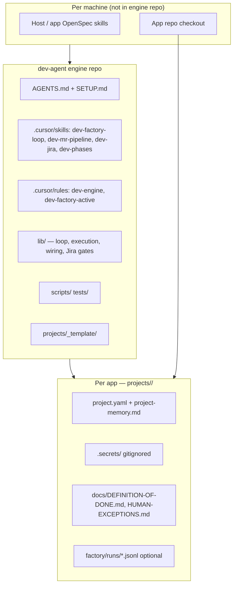

# Dev Agent — component map (engine vs project vs app)

Generic map of **what belongs where** when splitting an embedded in-app dev factory into the
three-layer model. For agent step-by-step installation, use **`SETUP.md`**.

See also: **`ARCHITECTURE.md`** (decision record) · **`PORTABILITY.md`** (repo split).

---

## Three layers (same pattern as qa-agent)

| Layer | Git home | Contains |
|-------|----------|----------|
| **Engine** | `dev-agent` (public/generic) | Loop, scripts, portable `lib/`, generic skills/rules |
| **Project** | `dev-agent-project-<slug>` or local `projects/<slug>/` | Config, secrets, DoD, human exceptions |
| **App** | Application repo | Product code, OpenSpec, CI gate, MR/deploy scripts |

**Handoff boundary:** Dev stops at **Validate/Testing**; **qa-agent** owns Done. Integration is Jira-only.

---

## Architecture



---

## What moves to the engine (genericize)

When extracting from an app that embedded dev-factory code:

| Embedded in app (typical) | Engine destination | Genericization |
|---------------------------|-------------------|----------------|
| Loop / tick / arm scripts | `scripts/dev_factory_tick.*`, `arm_dev_loop.sh`, `dev-loop.sh` | `<slug>` arg; load `projects/<slug>/project.yaml` |
| JQL + handoff helpers | `lib/projectConfig.ts`, `lib/jiraCommentGate.ts` | Epic, regex, STG from config — no hardcoded keys |
| Loop wiring / execution | `lib/devFactoryLoop*.ts`, `lib/devFactoryExecution.ts` | Loop purpose from `loop.purpose` in yaml |
| Handoff / preflight scripts | `scripts/post_jira_handoff.ts`, `preflight_jira_handoff.ts` | Project secrets + transition ids from yaml |
| STG verify | `scripts/check_stg_build.ts`, `lib/stgBuildCheck.ts` | STG URL from config |
| MR / deploy wait | `scripts/wait_*.sh` + `run_app_script.sh` | Delegate to app repo scripts via yaml |
| Factory skills / rules | `.cursor/skills/dev-*`, `.cursor/rules/dev-*` | Placeholders only — no product names |
| Hooks | `.cursor/hooks/dev-factory-*` | Engine-relative paths |
| Unit tests for above | `tests/unit/*.test.ts` | Fixture keys (`TST-*`), not live Jira keys |

---

## What moves to the project repo

| Item | Project path | Notes |
|------|--------------|-------|
| Epic, JQL filters, excluded keys | `project.yaml` → `dev_factory` | Was hardcoded in app lib |
| Git host, STG URL, app pointer | `project.yaml` → `git`, `stg`, `app` | |
| Gate / MR commands | `project.yaml` → `app.gate_command`, `mr_push_command` | App-specific CI |
| DoD + human exceptions | `docs/DEFINITION-OF-DONE.md`, `HUMAN-EXCEPTIONS.md` | |
| MR / OpenSpec overrides | `.cursor/rules/mr-pipeline-workflow.mdc` optional | |
| Secrets | `.secrets/jira.env`, `.secrets/bitbucket.env` | Never committed |
| Session memory | `project-memory.md` | Agent updates each run |
| Factory ledger (optional) | `factory/runs/*.jsonl` | |

Do **not** ship live `projects/<slug>/` inside the engine GitHub repo.

---

## What stays in the app repo

| Item | Why |
|------|-----|
| Product source, components, APIs | Application domain |
| `openspec/**` + OpenSpec skills | Product behavior specs |
| CI gate, MR push, pipeline wait scripts | Invoked via `project.yaml` delegation |
| e2e / integration tests | Product quality |
| Ticket grooming examples (optional) | Product-specific backlog content |

After wiring dev-agent, **remove duplicated** engine files from the app and add a thin pointer in app `AGENTS.md`:

```markdown
## Dev factory
Engine: `../dev-agent/` · project slug: `<slug>`
Setup: `../dev-agent/SETUP.md` · Arm: `bash ../dev-agent/scripts/arm_dev_loop.sh <slug>`
```

---

## Agent: install dev-agent on an existing app

**Full runbook:** **`SETUP.md`**. Summary for migration:

| Step | Agent action | Verify |
|------|--------------|--------|
| 1 | Clone `dev-agent` sibling to app; run `HOST_SETUP.md` + `npm install` | `bash tests/run_tests.sh` exit 0 |
| 2 | `bash scripts/new_project.sh <slug> <EPIC-KEY> "<Name>"` **or** clone `dev-agent-project-<slug>` into `projects/<slug>/` | `setup_verify.sh <slug> --scaffold` → `SETUP_SCAFFOLD_OK` |
| 3 | Edit `project.yaml`: `app.repo_path`, git, STG, gate commands | `resolve_app_root.ts <slug>` → existing directory |
| 4 | Copy + fill `.secrets/jira.env`, `.secrets/bitbucket.env` | `setup_verify.sh <slug>` → `SETUP_OK` |
| 5 | Migrate DoD docs from app → `projects/<slug>/docs/` | Files exist |
| 6 | Open Cursor on `dev-agent/` or parent workspace | Engine rules visible |
| 7 | Remove embedded factory files from app; thin pointer in app `AGENTS.md` | App MR = product only |
| 8 | `bash scripts/dev_factory_tick.sh <slug>` then arm loop | Tick sentinel + handoff path works |

Pair with **qa-agent** using the **same `<slug>`** under `projects/<slug>/` in both engines.

---

## MR boundaries

| MR target | Allowed changes | Gate |
|-----------|-----------------|------|
| **Engine** | `lib/`, `scripts/`, `.cursor/`, `tests/`, `projects/_template/`, generic docs | `portability_check.sh` + `run_tests.sh` |
| **Project** | `projects/<slug>/` config, docs, memory — no secrets | Never commit `.secrets/` |
| **App** | Product code, OpenSpec, app CI only | No duplicated engine `lib/` |

---

## Related docs

| Doc | Use when |
|-----|----------|
| **`SETUP.md`** | Agent installs dev-agent on a project (primary) |
| **`ARCHITECTURE.md`** | Understanding layer boundaries |
| **`ENGINE-REVIEW.md`** | Pre-publish / pre-MR portability review |
| **`PORTABILITY.md`** | Submodule vs clone patterns |
